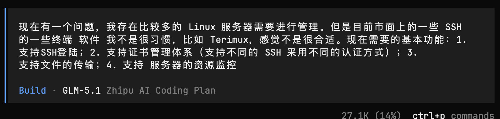
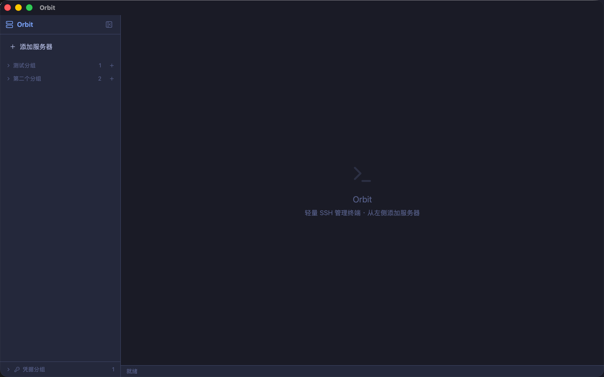
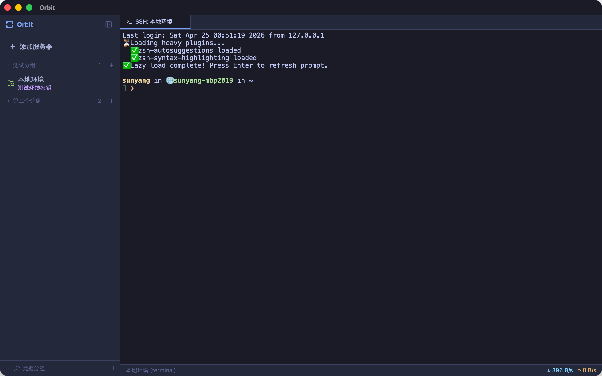
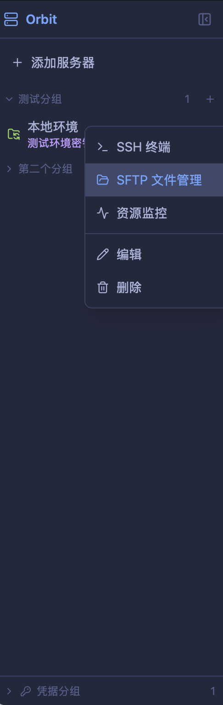
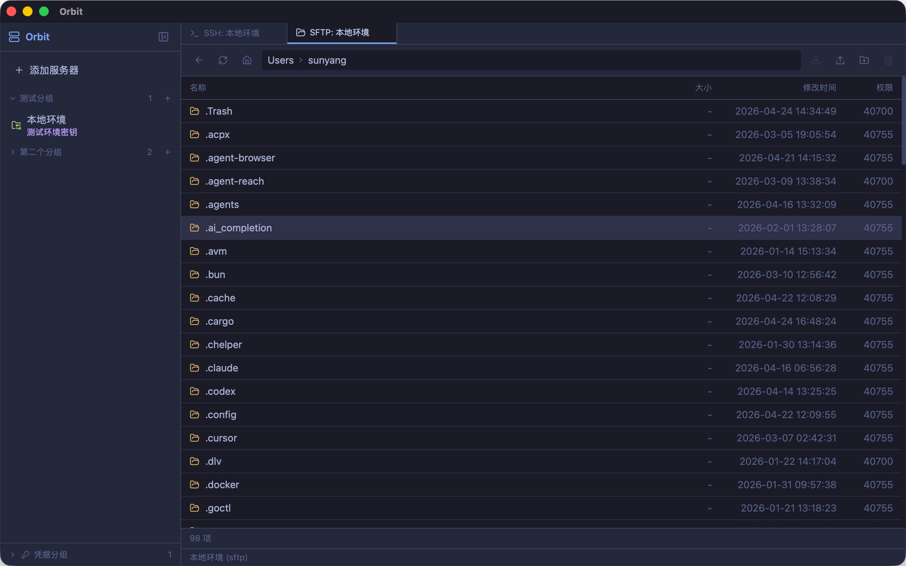
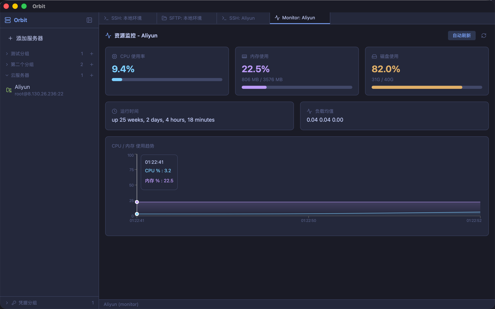
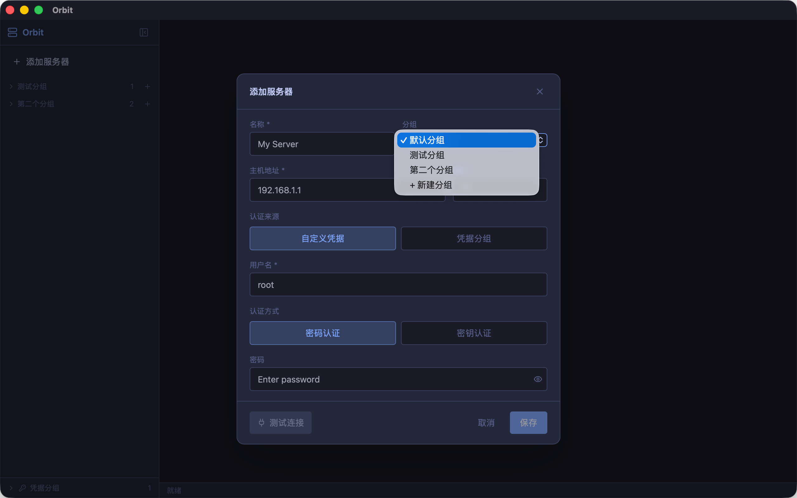

# 从零打造 SSH 管理客户端｜OpenCode + GLM5.1 全流程 AI 协作实录

## 写在前面

市面上的 SSH 终端工具不少，Termius、electerm、FinalShell……但总有些地方不够顺手。作为一个程序员，我有一个大胆的想法：为什么不自己写一个？

更准确地说——我让 AI 帮我写了一个。

但这不是那种「丢个需求给 AI 就出成品」的爽文故事。真实的协作过程是：**我一开始连自己想要什么都不清楚，是 AI 帮我把模糊的想法梳理成完整的需求文档，然后一步步变成可用的产品。**

全程使用 **OpenCode（命令行 AI 编码工具）+ GLM5.1（智谱大模型）** 协作完成。今天把整个过程、踩过的坑、总结出的技巧一次性分享出来。

> PS: 目前的一些 终端都很好，我个人不习惯而已。

***

## 一、起点：一个模糊的想法

故事的开头是这样的——我在 OpenCode 终端里输入了这么一段话：



没错，就这么几行字。需求描述里甚至还有口语化表达和错别字（把 Termius 打成了 Terimux），功能点也是想到哪写到哪——SSH 登录、证书管理、文件传输、资源监控。

如果是一个传统开发流程，我大概要花一两天写 PRD、画原型、定技术方案。但这一次，我直接把这个问题抛给了 AI。

注意右上角的状态：`Build · GLM-5.1`——AI 已经在开始规划编码方案了。从「一句话需求」到「AI 开始构建」，中间几乎零等待。

***

## 二、最关键的一步：AI 帮我理清需求

AI 做的第一件事不是写代码，而是**帮我想清楚我要做什么**。

它问了我几个关键问题：

- 目标用户是谁？（个人用还是团队用）
- 偏好桌面端还是 Web 端？
- 核心场景是什么？（终端连接、文件传输、还是运维监控）
- 对安全和认证有什么要求？

通过几轮对话，AI 帮我梳理出了清晰的需求轮廓：

```
产品定位：个人开发者用 SSH 管理桌面客户端
核心功能：
  1. SSH 终端连接 + 多 Tab
  2. 证书管理体系（密钥 + 密码）
  3. SFTP 文件传输
  4. 服务器资源监控
技术选型：Tauri 2 + React + Rust（轻量、原生性能）
```

**这一步太重要了。** 很多人的 AI 编程体验不好，不是因为 AI 能力不行，而是因为需求没想清楚就开始写，写到一半推翻重来，来回折腾。

**AI 的价值不只是写代码——它是一个很好的「需求共创伙伴」。** 它能从你的只言片语中提炼出结构化的需求，帮你发现遗漏的点，逼你想清楚优先级。

### 需求梳理的关键技巧

**技巧 1：别怕说「我也不知道」**

你不需要上来就给出完整的需求文档。就像跟一个靠谱的技术合伙人聊天一样，把你的痛点和模糊想法说出来，AI 会引导你把细节补全。

**技巧 2：让 AI 给选项，你来拍板**

比如我一开始没想好是做桌面端还是 Web 端。AI 列出了各自的优劣：

- 桌面端：原生体验好，SSH 连接稳定，但分发麻烦
- Web 端：跨平台访问方便，但 SSH 代理复杂

我看了一眼就决定了：桌面端，Tauri 方案。这种决策让 AI 给选项比自己做调研快得多。

**技巧 3：需求一定要落实到文字**

AI 梳理完需求后，我让它写了一份结构化的需求清单。这份清单后来成了整个开发的路线图，后续所有功能都是围绕它迭代的。

***

## 三、从需求到产品：AI 的自主迭代能力

需求定下来之后，有趣的事情发生了。

我并没有一个功能一个功能地指挥 AI 怎么写。AI 拿到需求后，**自主规划了实现路径**，从项目搭建到功能实现，一路迭代出了可用的产品：

```
第 1 轮：项目骨架
  → Tauri 2 + React 19 + TypeScript + Tailwind CSS
  → Tokyo Night 主题色配置
  → 基础布局（侧边栏 + 主内容区）

第 2 轮：核心功能
  → SSH 终端连接（xterm.js + ssh2 + PTY）
  → SQLite 数据库（服务器信息持久化）
  → 服务器增删改查

第 3 轮：能力扩展
  → SFTP 文件管理（浏览/上传/下载/删除）
  → 资源监控（CPU/内存/磁盘 + recharts 实时图表）
  → 多 Tab 管理

第 4 轮：体验打磨
  → 服务器分组 + 拖拽排序
  → 密钥认证（内容粘贴 + 本地文件路径）
  → 凭据分组管理
  → SSH 流量统计
```

每一轮 AI 都是基于上一轮的成果继续构建，像搭积木一样，最终得到 **Orbit**——一个完整的 SSH 管理客户端。



这是 Orbit 的首屏。深色主题（Tokyo Night 配色），左侧侧边栏展示分组和服务器列表，右侧是引导提示。界面干净，没有多余元素。这个设计是 AI 根据我提的「简洁好用」的偏好自动生成的——我甚至没有画过原型图。

这个过程中我的角色是：

- **初期**：回答 AI 的问题，做技术选型决策
- **中期**：验收每个功能，反馈 Bug 和体验问题
- **后期**：提出优化方向，让 AI 继续迭代

**不是我指挥 AI 写代码，而是 AI 驱动开发，我来掌舵。**

### 3.1 SSH 终端——连接成功的那一刻



SSH 连接成功后的界面。右侧是完整的终端输出，底部状态栏显示实时流量：`↓396 B/s ↑0 B/s`——这是我自己提的一个小需求，想在状态栏看到当前连接的网络流量，AI 用 1.5 秒轮询的方式实现了。

注意终端里 zsh 的插件加载提示（autosuggestions、syntax-highlighting）都正常渲染，说明 xterm.js 对 256 色和特殊字符的支持没有问题。Tab 栏顶部可以看到已打开的连接标签，多服务器切换很方便。

### 3.2 侧边栏——右键菜单设计



侧边栏的设计也经过了迭代。最终方案是：点击服务器条目弹出操作菜单，包含 SSH 终端、SFTP 文件管理、资源监控、编辑、删除五个操作。分组支持展开/折叠，每个分组右侧显示服务器数量。

这个右键菜单的图标和布局是 AI 一次性生成的，没有做任何修改——AI 在 UI 细节上的审美 surprisingly 不错。

### 3.3 SFTP 文件管理



SFTP 面板默认打开用户的 home 目录，支持浏览、上传、下载、删除、新建文件夹。文件列表展示名称、大小、修改时间、权限四列信息。

图中展示的是用户的 home 目录，可以看到 `.cargo`、`.docker`、`.config` 等常见的开发工具配置目录都正常显示。权限列的 `40755`、`40700` 等 Linux 权限码也准确解析——这些细节 AI 都处理得很好。

### 3.4 资源监控——实时趋势图



这是连接阿里云服务器后的监控面板。三个核心指标卡片一目了然：

- **CPU 使用率 9.4%**——浅蓝色进度条，负载很轻
- **内存使用 22.5%**（806 MB / 3576 MB）——紫色进度条
- **磁盘使用 82.0%**（31 GB / 40 GB）——橙色进度条，提醒需要关注

下方还有运行时间（25 周 2 天）和负载均值。底部的 CPU/内存实时趋势图用 recharts 绘制，数据通过 SSH 执行 shell 脚本采集，自动刷新。

整个监控面板从提出需求到实现完成，AI 只用了一轮对话。而且图表的配色（蓝/紫/橙）和整体 Tokyo Night 主题完全协调——这种一致性如果手写 CSS 要调很久。

***

## 四、产品迭代：围绕可用产物的持续优化

有了能跑的初版之后，后续就是围绕真实使用场景不断打磨。这个阶段的协作模式变了——不再是「从零构建」，而是「精确修改」。

### 案例 1：分组选择器的三版迭代

第一版：下拉菜单 + 确认按钮
→ 我觉得太重了，日常操作不该有这么多步骤

第二版：选「新建分组」后弹输入框
→ 还是多了一步，不够直接

第三版：选「新建分组」后下拉框直接变成输入框，输入即生效
→ 这才对。三步变一步。

AI 没有抱怨改了三版。每版都准确理解了我的意图，快速给出实现。**好的 AI 协作不是一次到位，而是快速迭代。**



最终版的效果：下拉菜单展示已有分组（默认分组、测试分组、第二个分组），蓝色高亮标识当前选中项，底部「+ 新建分组」点击后下拉框直接变成输入框。简洁、直观、零多余操作。

### 案例 2：认证逻辑的隐含 Bug

密钥认证有两种方式：直接粘贴密钥内容，或指定本地文件路径。早期代码里，即使认证类型是密码，还是去尝试读密钥文件——因为残留了 `key_source` 字段。

我描述了现象，AI 立刻定位到 `ResolvedAuth::resolve` 函数，加了类型前置判断。

**教训：AI 写的逻辑代码，边界条件必须人工把关。**

***

## 五、真实踩坑记录

### 坑 1：ssh2 交叉编译不过

目标是在 Apple Silicon 上交叉编译。`ssh2` crate 依赖 OpenSSL，直接编译报错。

解法：`ssh2 0.9.x` 没有 `vendored` feature，需要单独加 `openssl-sys = { version = "0.9", features = ["vendored"] }`，让 OpenSSL 从源码编译。

这种问题 StackOverflow 上都不一定有答案，但 AI 能读 crate 文档和源码，给出精准方案。

### 坑 2：`~` 路径不生效

用户输入 `~/.ssh/id_rsa`，Rust 的 `std::fs` 不会自动展开 `~`。

AI 一次就考虑到了这个边界情况，写了 `expand_tilde()` 函数，用 `dirs::home_dir()` 手动替换。

### 坑 3：数据库迁移兼容性

功能迭代过程中多次修改表结构。AI 用 `ALTER TABLE` + 忽略错误的方式，保证新版本能兼容旧数据库，不需要用户重新配置。

***

## 六、AI Coding 的正确打开方式

### 6.1 整个协作过程的三个阶段

回顾整个项目，AI 协作其实经历了三个截然不同的阶段：

| 阶段       | 我做什么       | AI 做什么         |
| -------- | ---------- | -------------- |
| **需求共创** | 描述痛点、做决策   | 提问引导、梳理需求、给出选项 |
| **自主构建** | 验收、反馈 Bug  | 规划实现路径、编码、自我迭代 |
| **持续优化** | 提体验问题、定优先级 | 精确修改、快速迭代      |

**很多人只关注第二阶段（AI 写代码），但第一阶段（需求共创）才是决定项目成败的关键。** 需求错了，代码写得再好也没用。

### 6.2 AI 擅长什么

- **需求梳理**：从模糊想法到结构化需求，AI 是很好的引导者
- **脚手架搭建**：项目初始化、依赖配置、文件结构
- **模式化代码**：CRUD、表单、列表、状态管理
- **跨语言协作**：前端 TypeScript + 后端 Rust，AI 两边都能写
- **Bug 定位**：给定错误信息，快速定位并修复

### 6.3 AI 不擅长什么

- **产品决策**：「这个交互该不该加确认按钮」需要人来拍板
- **逻辑边界**：复杂的条件分支和隐含约束，需要人把关
- **运行时验收**：AI 不能帮你跑程序看效果，验收必须自己做

### 6.4 最佳实践

| 实践           | 说明                             |
| ------------ | ------------------------------ |
| 先理需求再写代码     | 花 30 分钟梳理需求，省 3 小时返工           |
| 维护 AGENTS.md | 让 AI 每次会话都有完整上下文               |
| 拆小需求         | 一次一个功能，做完验收再做下一个               |
| 具体反馈         | 「第 42 行变量名拼错了」比「有 bug」有效 100 倍 |
| 自己验收         | AI 写完必须编译、运行、测试                |
| 版本控制         | 每个功能点一次提交，出问题可回滚               |

***

## 七、关于效率

用 AI 协作写这个项目，效率大概是纯手写的 **3-5 倍**。

但效率提升不只是「写代码快」：

- **需求梳理时间归零**：不用自己憋 PRD，AI 几轮对话就理清楚了
- **搜索时间归零**：不用翻文档查 API，AI 直接给出用法
- **调试时间减半**：报错丢给 AI，大部分问题秒解
- **上下文切换成本降低**：前端后端 AI 都能写

隐性成本：

- **验收时间**：AI 写的每一行代码你都得看得懂
- **沟通成本**：需求不够清晰时会来回几轮
- **学习成本**：跟 AI 高效沟通本身就是一种技能

***

## 八、写在最后

[Orbit](https://github.com/ibreez3/orbit) 目前是 v0.0.0-beta.1，功能基本完整，已推到 GitHub（github.com/ibreez3/orbit）。后续打算加 SFTP 文件选择器、密码加密存储、更完善的监控兼容性。

回头看这个项目，最大的收获是验证了一件事：

**AI Coding 最有价值的能力不是写代码，而是帮你从「我好像想做点什么」到「这就是我想要的东西」。** 需求共创 → 自主构建 → 持续优化，这才是一个完整的 AI 协作闭环。

如果你也想尝试 AI 辅助编程，我的建议是：**别等想清楚再开始，直接跟 AI 聊你的想法。** 你负责方向和决策，AI 负责帮你理清楚、写出来、迭代好。

有问题欢迎评论区交流，也欢迎去 GitHub 给 Orbit 提 issue ⭐

***

> 📌 **本文核心观点：**
>
> 1. AI 协作的第一步不是写代码，而是需求共创——这是最容易被忽视但最有价值的环节
> 2. AI 能根据需求自主规划实现路径，迭代出可用产品，而非被动等待指令
> 3. 后续优化围绕真实产物展开，反馈越具体，AI 迭代越快
> 4. 效率提升 3-5 倍，但验收和决策的责任始终在人

***

> 🙋蹲队友拼智谱 Coding Plan！
>
> 🧩国内顶流编程大模型，20+主流工具全适配，性价比拉满，
> 👉立即参与「拼好模」：<https://www.bigmodel.cn/glm-coding?ic=WWLZRRMGL9>

<br />

**#AI编程 #OpenCode #GLM5 #智谱AI #Tauri #Rust #SSH工具 #程序员 #效率工具 #桌面应用开发 #需求分析**
